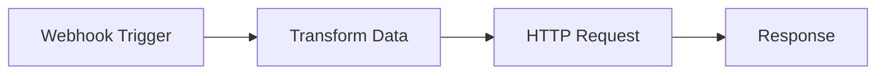

# Introduction to NodeTL

[](https://github.com/nodetl/nodetl/releases/tag/v1.0.1)
[](https://opensource.org/licenses/MIT)
[](https://hub.docker.com/r/nodetl/nodetl)

**NodeTL** is a powerful, open-source **visual data mapping and transformation platform** designed for building ETL pipelines and automating data workflows. With an intuitive drag-and-drop interface, you can design complex data mappings, transform data between any schemas, and create automated integration workflows without writing complex code.

## What is NodeTL?

NodeTL simplifies data integration by providing a visual interface to:

- **Map data** between different schemas and formats
- **Transform data** with built-in and custom transformations
- **Route data** between systems automatically
- **Automate workflows** with triggers and conditions

## Key Capabilities

### 🗺️ Visual Data Mapping

Design field-level mappings between source and target schemas using drag-and-drop. Handle complex nested structures, arrays, and type conversions visually.

```
Source Schema          Target Schema
├── user               ├── customer
│   ├── firstName  →   │   ├── name
│   ├── lastName   →   │   ├── fullName
│   └── email      →   │   └── contactEmail
```

### 🔄 Workflow Automation

Build automated data pipelines with a node-based visual designer:

- **Trigger nodes** - Start workflows via webhooks, schedules, or manual triggers
- **Transform nodes** - Apply data mappings and transformations
- **HTTP nodes** - Connect to external APIs
- **Condition nodes** - Branch workflows based on data conditions
- **Loop nodes** - Iterate over collections
- **Code nodes** - Custom JavaScript for advanced logic

### 🤖 AI-Powered Features

- Generate test data automatically based on your schemas
- Get intelligent mapping suggestions
- Leverage OpenAI integration for smart transformations

### 🔐 Enterprise Security

- Role-based access control (RBAC)
- SSO with Google and Microsoft
- JWT authentication with refresh tokens
- Granular permissions

## Why Choose NodeTL?

| Feature | Benefit |
|---------|---------|
| **Visual Interface** | No coding required for most data tasks |
| **Open Source** | MIT licensed, fully customizable |
| **Self-Hosted** | Complete control over your data |
| **Docker Ready** | Deploy anywhere in minutes |
| **API-First** | Integrate with any system |
| **Scalable** | Kubernetes support included |

## Quick Example

Here's a simple workflow that receives a webhook, transforms the data, and sends it to another API:



The Transform node uses visual mapping to convert the incoming payload to the target format:

```json
// Incoming webhook payload
{
  "user": {
    "firstName": "John",
    "lastName": "Doe",
    "email": "john@example.com"
  }
}

// Transformed output
{
  "customer": {
    "name": "John",
    "fullName": "John Doe",
    "contactEmail": "john@example.com"
  }
}
```

## Getting Started

Ready to start building? Follow our [Quick Start Guide](/docs/getting-started/quick-start) to deploy NodeTL in minutes.

### Installation Options

1. **[Docker Compose](/docs/getting-started/installation#docker-compose)** - Recommended for most users
2. **[All-in-One Docker](/docs/getting-started/installation#all-in-one-docker)** - Single container deployment
3. **[Kubernetes](/docs/deployment/kubernetes)** - For production clusters
4. **[Development Setup](/docs/development/setup)** - For contributors

## Architecture Overview

```
┌─────────────────────────────────────────────────────────────┐
│                      Frontend (React)                        │
│  ┌─────────────┐  ┌─────────────┐  ┌─────────────────────┐  │
│  │ Flow Canvas │  │  Node Panel │  │  Settings & Config  │  │
│  └─────────────┘  └─────────────┘  └─────────────────────┘  │
└─────────────────────────────────────────────────────────────┘
                              │
                              ▼
┌─────────────────────────────────────────────────────────────┐
│                    Backend (Go + Gin)                        │
│  ┌─────────────┐  ┌─────────────┐  ┌─────────────────────┐  │
│  │   Handlers  │  │  Executor   │  │    Repositories     │  │
│  └─────────────┘  └─────────────┘  └─────────────────────┘  │
└─────────────────────────────────────────────────────────────┘
                              │
                              ▼
┌─────────────────────────────────────────────────────────────┐
│                     MongoDB Database                         │
│  ┌───────────┐  ┌──────────┐  ┌────────────┐  ┌──────────┐  │
│  │ Workflows │  │ Versions │  │ Executions │  │ Schemas  │  │
│  └───────────┘  └──────────┘  └────────────┘  └──────────┘  │
└─────────────────────────────────────────────────────────────┘
```

## Next Steps

- [Installation Guide](/docs/getting-started/installation) - Set up NodeTL
- [Quick Start](/docs/getting-started/quick-start) - Build your first workflow
- [Core Concepts](/docs/concepts/workflows) - Understand the fundamentals
- [API Reference](/docs/api/overview) - Integrate programmatically
